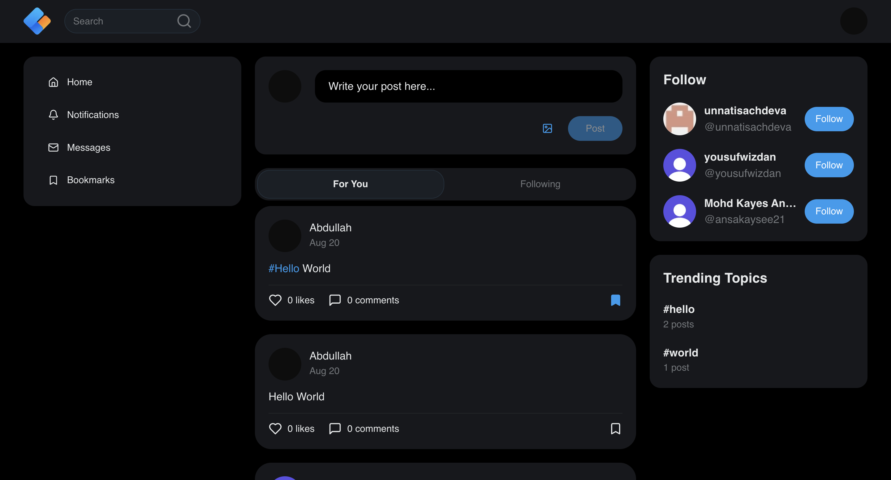

# Gather

[](https://nextjs.org/) [](https://www.typescriptlang.org/) [](https://tailwindcss.com/) [](https://vercel.com/)

## About The Project

**Live Demo:** [https://gather.notlocalhost.fun](https://gather.notlocalhost.fun) | **Repository:** [https://github.com/abdullah0408/gather](https://github.com/abdullah0408/gather)

Gather is a modern social media application designed for building communities and fostering connections. It provides a feature-rich platform where users can share posts, engage in real-time conversations, and follow topics and profiles that interest them. The project is built with a focus on performance, scalability, and a clean user experience.





## Features

- [x] **Full User Authentication:** Secure sign-up, sign-in, and profile management powered by Clerk.
- [x] **Social Feed:** A dynamic "For You" feed and a "Following" feed to keep up with other users.
- [x] **Post Creation & Interaction:** Create text-based posts, with support for likes, comments, and bookmarks.
- [x] **User Profiles:** Viewable user profiles with post history, follower/following counts, and an option to edit.
- [x] **Follow System:** Follow and unfollow other users to customize your social feed.
- [x] **Real-time Messaging:** One-on-one and group chat functionality powered by Stream.
- [x] **Notifications:** Receive notifications for likes, new followers, and other interactions.
- [x] **Image Uploads:** Upload profile pictures and other media using ImageKit (migrated from UploadThing).
- [x] **Global Search:** Search for users and posts across the platform.

## Tech Stack

| Category | Technology |
| :--- | :--- |
| **Framework** | [Next.js](https://nextjs.org/) |
| **Language** | [TypeScript](https://www.typescriptlang.org/) |
| **Styling** | [Tailwind CSS](https://tailwindcss.com/) |
| **UI Components** | [shadcn/ui](https://ui.shadcn.com/) |
| **State Management** | [TanStack Query](https://tanstack.com/query/latest) |
| **Database ORM** | [Prisma](https://www.prisma.io/) |
| **Authentication** | [Clerk](https://clerk.com/) |
| **File Uploads** | [ImageKit](https://imagekit.io/) (migrated from [UploadThing](https://uploadthing.com/)) |
| **Real-time Chat** | [Stream](https://getstream.io/chat/) |
| **Deployment** | [Vercel](https://vercel.com/) |

## Getting Started

Follow these instructions to get a copy of the project up and running on your local machine for development and testing purposes.

### Prerequisites

- [Node.js](https://nodejs.org/) (v20 or later)
- [NPM](https://www.npmjs.com/)
- [Git](https://git-scm.com/)

### Installation

1.  **Clone the repository:**
    ```sh
    git clone https://github.com/your-username/gather.git
    cd gather
    ```

2.  **Install dependencies:**
    ```sh
    npm install
    ```

3.  **Set up environment variables:**
    Create a `.env` file in the root of the project by copying the example file.
    ```sh
    cp .env.example .env
    ```
    Then, fill in the required values in the `.env` file as described in the [Environment Variables](#environment-variables) section.

4.  **Set up the database:**
    Push the Prisma schema to your PostgreSQL database.
    ```sh
    npx prisma db push
    ```

5.  **Run the development server:**
    ```sh
    npm run dev
    ```
    The application should now be running at [http://localhost:3000](http://localhost:3000).

## Environment Variables

The following variables are required to run the application. These should be placed in a `.env` file in the project root.

| Variable | Description |
| :--- | :--- |
| `DATABASE_URL` | The connection string for your PostgreSQL database. |
| `NEXT_PUBLIC_CLERK_PUBLISHABLE_KEY` | Your publishable API key from the Clerk dashboard. |
| `CLERK_SECRET_KEY` | Your secret API key from the Clerk dashboard. |
| `CLERK_WEBHOOK_SECRET_KEY` | The secret for verifying Clerk webhooks. |
| `NEXT_PUBLIC_APP_URL` | The full URL of your application (e.g., `http://localhost:3000`). |
| `UPLOADTHING_SECRET` | Your secret API key from the UploadThing dashboard. (Deprecated: Last used in commit e6aa0e0, migrated to ImageKit) |
| `NEXT_PUBLIC_UPLOADTHING_APP_ID` | Your app ID from the UploadThing dashboard. (Deprecated: Last used in commit e6aa0e0, migrated to ImageKit) |
| `IMAGEKIT_PUBLIC_KEY` | Your public API key from the ImageKit dashboard. |
| `IMAGEKIT_PRIVATE_KEY` | Your private API key from the ImageKit dashboard. |
| `IMAGEKIT_URL_ENDPOINT` | Your ImageKit URL endpoint. |
| `CRON_SECRET` | A secret key to secure cron job endpoints. |
| `NEXT_PUBLIC_STREAM_KEY` | Your API key from the Stream dashboard. |
| `STREAM_SECRET` | Your API secret from the Stream dashboard. |

## Project Structure

The project uses the Next.js App Router for routing and project structure.

```
/
├── prisma/                 # Prisma schema, client, and migrations
├── public/                 # Static assets (images, logos, fonts)
├── src/
│   ├── app/                # Next.js App Router pages and layouts
│   │   ├── (auth)/         # Authentication-related pages (sign-in, sign-up)
│   │   ├── (main)/         # Core application pages (feed, profile, messages)
│   │   │   ├── bookmarks/
│   │   │   ├── messages/
│   │   │   ├── notifications/
│   │   │   ├── profile/[username]/
│   │   │   └── ...
│   │   └── api/            # API routes for backend functionality
│   │       ├── posts/
│   │       ├── user/
│   │       ├── notifications/
│   │       └── ...
│   ├── components/         # Reusable React components
│   │   ├── posts/          # Components for post creation, display, and interaction
│   │   ├── comments/       # Components for comment display and input
│   │   └── ui/             # UI components from shadcn/ui
│   ├── contexts/           # React context providers (Auth, ReactQuery)
│   ├── hooks/              # Custom React hooks for shared logic
│   ├── lib/                # Core libraries, utilities, and client initializations
│   │   ├── ky.ts           # Ky HTTP client instance
│   │   ├── prisma.ts       # Prisma client instance
│   │   ├── stream.ts       # Stream chat client initialization
│   │   ├── imageKit.ts     # ImageKit SDK initialization
│   │   ├── uploadthing.ts  # UploadThing helper utilities (Deprecated: Last used in commit e6aa0e0, migrated to ImageKit)
│   │   ├── utils.ts        # General utility functions
│   │   └── validation.ts   # Zod validation schemas
│   └── middleware.ts       # Edge middleware for authentication
├── .env.example            # Example environment variables
├── next.config.ts          # Next.js configuration
└── package.json            # Project dependencies and scripts
```

## Key Components

This section describes the functionality of major components that are central to the application's features.

> **Migration Note**: The application has recently migrated from UploadThing to ImageKit for file uploads. This change improves media handling capabilities and provides a more robust solution for user uploads. UploadThing was last used in commit [e6aa0e0](https://github.com/abdullah0408/gather/commit/e6aa0e0).

| Component | Description |
| :--- | :--- |
| `ForYouFeed.tsx` / `FollowingFeed.tsx` | These components are responsible for fetching and rendering the two main social feeds. They use infinite scrolling to load more posts as the user scrolls down. |
| `posts/Post.tsx` | Renders a single post with its content, author information, and interaction buttons (Like, Comment, Bookmark). It manages the state for these interactions. |
| `posts/editor/PostEditor.tsx` | A rich-text editor for composing new posts, likely using a library like Tiptap. It handles the form state and submission. |
| `comments/Comments.tsx` | Fetches and displays the list of comments for a given post. It includes the `CommentInput` component to allow users to add new comments. |
| `messages/Chat.tsx` | The main interface for the real-time messaging feature. It displays the conversation history and allows users to send and receive messages. |
| `profile/EditProfileDialog.tsx` | A dialog modal containing a form to update user profile information, including display name, bio, and profile picture. |
| `SearchField.tsx` | A client-side component that takes user input, debounces it, and triggers a search query to the backend API. |
| `Navbar.tsx` | The main navigation bar for the application, providing links to the home feed, notifications, messages, and the user's profile. |

## API Reference

The backend is built with Next.js API Routes. Here are the main endpoints:

| Endpoint | Method(s) | Description |
| :--- | :--- | :--- |
| `/api/posts/for-you` | `GET` | Fetches posts for the user's "For You" feed. |
| `/api/posts/following` | `GET` | Fetches posts from users that the current user is following. |
| `/api/posts/bookmarked` | `GET` | Fetches posts that the current user has bookmarked. |
| `/api/posts/[postId]/like` | `POST`, `DELETE` | Likes or unlikes a specific post. |
| `/api/posts/[postId]/bookmark` | `POST`, `DELETE` | Bookmarks or unbookmarks a specific post. |
| `/api/posts/[postId]/comments` | `GET`, `POST` | Fetches comments for a post or adds a new comment. |
| `/api/user/[userId]/follow` | `POST`, `DELETE` | Follows or unfollows a specific user. |
| `/api/user/[userId]` | `GET` | Fetches public profile information for a specific user. |
| `/api/notifications` | `GET` | Fetches the current user's notifications. |
| `/api/notifications/unread-count` | `GET` | Gets the count of unread notifications. |
| `/api/messages/unread-count` | `GET` | Gets the count of unread messages. |
| `/api/search` | `GET` | Searches for users and posts based on a query string. |
| `/api/get-token` | `GET` | Generates a token for the Stream chat client. |
| `/api/uploadthing` | `POST` | Handles file uploads, managed by the UploadThing library. (Deprecated: Last used in commit e6aa0e0, migrated to ImageKit) |
| `/api/clerk/webhooks` | `POST` | Receives webhooks from Clerk to sync user data with the database. |

## Available Scripts

The following scripts are available in the `package.json`:

| Script | Description |
| :--- | :--- |
| `npm run dev` | Starts the development server with Turbopack. |
| `npm run build` | Builds the application for production. |
| `npm run start` | Starts the production server. |
| `npm run lint` | Runs the Next.js linter to check for code quality issues. |